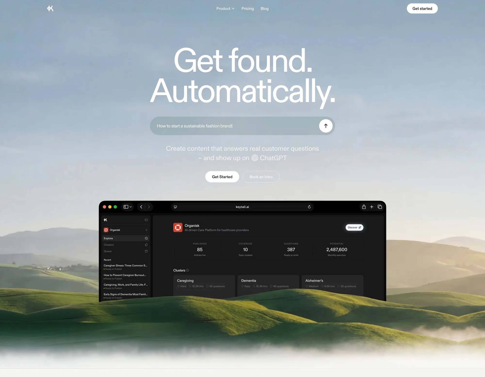
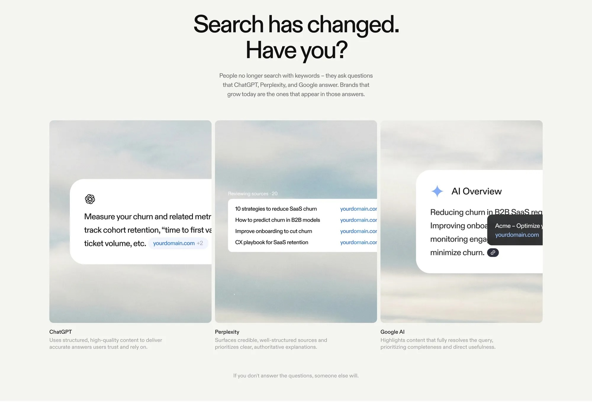
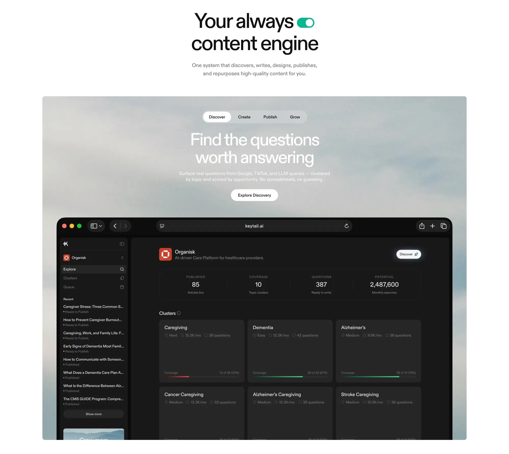
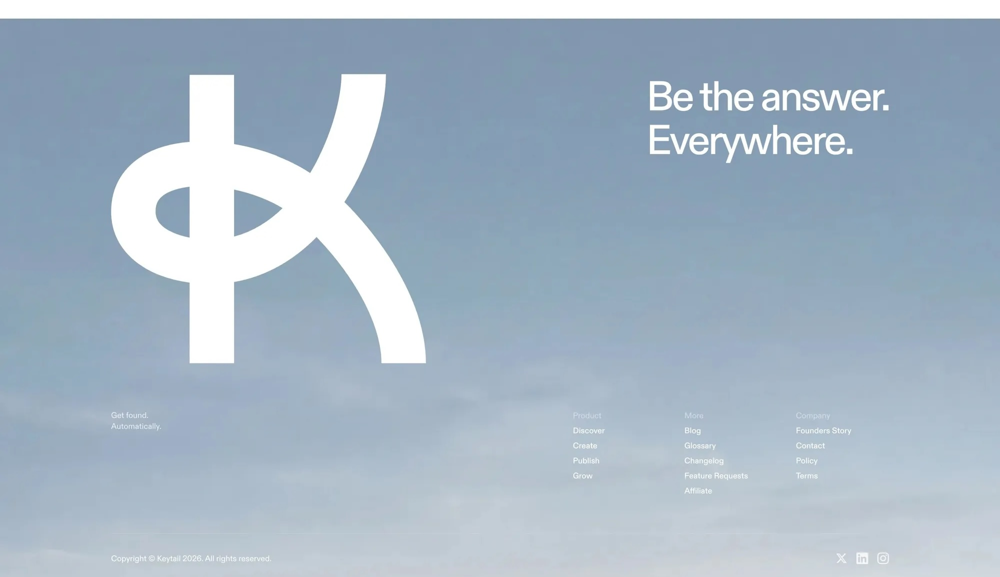

# Keytail Design Map — `performant_labs_20260418`

> **Stage:** 0 — Design Analysis (Phase 3 + 4 output)
> **Parent:** [`pl-plan--design.md`](../pl-plan--design.md)
> **Source clips:** `docs/pl2/keytail-design/*.jpg`
> **Priority order:** Matches [`pl-plan--component-audit.md`](../pl-plan--component-audit.md) § Priority Order for Stage 2

**Mobile clips:** No mobile source was committed. Mobile behaviour is verified live at 375px viewport using `?theme=performant_labs_20260418`.

---

## Design Language Notes

Before the per-component table, read these once — they govern every decision below.

| Token | Keytail reference | PL brand adaptation |
|---|---|---|
| **Primary surface (dark)** | Sky-gradient blue-grey | `#1B2638` navy |
| **Primary surface (light)** | Off-white `#FAFAF8` / cream | `#F0F1F0` off-white |
| **Accent / CTA** | Black filled pill | `#F59E0B` amber filled pill |
| **Text on dark** | White | White — unchanged |
| **Text on light** | Near-black `#111` | `#2D3E48` dark steel navy |
| **Border / separator** | `#e5e7eb` 1px | same |
| **Border radius — cards** | `1rem` / `~16px` rounded-xl | same |
| **Typography** | System sans / display weight | Inter (loaded via Google Fonts) |
| **Watermark / brand mark** | Giant white `K` in footer bg | Adapt `K` → `PL` ligature or equivalent |

---

## 1. Hero

| | Desktop |
|---|---|
| **Clip** |  |
| **Clip source** | `keytail-desktop-homepage.jpg` — s00, canonical appearance |
| **Design intent** | Full-viewport background image (sky/nature photo), transparent header floats above; large bold display headline centred; search bar below with black circle submit; two pill CTAs ("Get Started" solid white + "Book an Intro" outline); product screenshot mockup anchored below fold |
| **Key observations** | Header is fully transparent — merged into hero zone; no visible background colour until scroll. Hero background is a *photo fill* not a CSS gradient — the existing audit's `radial-gradient` overlay sits *on top of* the PL brand navy background colour. PL has no photo asset so the gradient-over-navy approach is the correct adaptation. |
| **Stage 2 action** | **Improve** — hero exists in `20260411`; port the gradient overlay and background colour variable, and improve: add `backdrop-filter` blur on scroll for the header, confirm hero text is white and readable against `#1B2638`. |

---

## 2. Header (transparent sticky)

| | Desktop |
|---|---|
| **Clip** |  |
| **Clip source** | Shared from s00-homepage — header is visible at top of hero clip |
| **Design intent** | Minimal transparent header: brand mark (stylised `K`) on far left; nav links (Product ▾, Pricing, Blog) centred; single white pill CTA ("Get started") on far right. No background colour — fully transparent over hero. On scroll: becomes opaque with `backdrop-filter: blur`. |
| **Key observations** | The CTA in the header is a white filled pill — identical shape to the hero "Get Started" button but smaller. On PL: the header CTA becomes an amber pill. Nav links are white-on-transparent in hero zone, dark-on-white in body. |
| **Stage 2 action** | **Improve** — port transparent sticky header from `20260411`; improve: ensure the scroll-to-opaque transition uses `rgba(255,255,255,0.95)` + `backdrop-filter: blur(8px)` and amber CTA appears correctly against both the dark hero and the light body sections. |

---

## 3. content-card

| | Desktop |
|---|---|
| **Clip** |  |
| **Clip source** | `keytail-desktop-slice1.jpg` — s01, primary content card appearance |
| **Design intent** | Three horizontal cards on a cream/off-white section background. Each card: white fill, `border-radius ~1rem`, subtle `box-shadow` (low spread, soft), internal padding, text content with a coloured domain-link badge at the bottom. No visible border. On hover (not shown): lift via `translateY(-2px)`. |
| **Key observations** | Cards have no coloured accent stripe or border — the elevation comes entirely from the shadow. The section background is `#FAFAF8`/cream, not white, making the white cards pop. Cards are equal-height in a 3-col grid desktop, stack single-column mobile. |
| **Stage 2 action** | **Port as-is** — the existing `20260411` card implementation (shadow + radius + hover lift) maps exactly to the Keytail reference. Only change: ensure `--theme-surface` drives the card bg token so it stays white even when nested in a light zone. |

---

## 4. button--cta / button--pill-dark

| | Desktop |
|---|---|
| **Clip** |  |
| **Clip source** | Shared from s00-homepage — most complete button appearance (two variants side-by-side in hero) |
| **Design intent** | **Primary CTA:** solid fill, fully pill-radius (`border-radius: 999px`), no border visible, bold label. In Keytail: white fill / dark text. PL adaptation: amber fill (`#F59E0B`) / navy text (`#1B2638`). **Secondary / outline:** same pill radius, transparent fill, visible border, lighter label. Audience section (slice3) also shows a small borderless pill button ("Get in touch") — same radius, outline variant. |
| **Key observations** | The search bar "submit" button is a black circle icon button — that is a search input widget, not the global CTA component. The two hero buttons are the canonical CTA reference. Hover state not visible in clip — use amber-darken-10% convention from `base.css`. |
| **Stage 2 action** | **Port as-is** — amber fill pill (`#F59E0B` bg, `#1B2638` text) and black pill dark are already defined in `20260411`. Port via `libraries-extend` on the button component. |

---

## 5. accordion

| | Desktop |
|---|---|
| **Clip** |  |
| **Clip source** | `keytail-desktop-slice5.jpg` — s05, FAQ section, only accordion appearance |
| **Design intent** | Ultra-minimal accordion: rows separated by thin `1px` horizontal rules only — no card background, no border-radius, no box-shadow. Each row: question text left-aligned, `+` icon right-aligned (collapsed state). Section heading "FAQ" is large, centred, bold. No filled background on any row. |
| **Key observations** | The `+` icon — in Keytail it is a plain black `+` on a white bg. PL adaptation: `+` becomes **amber** (`#F59E0B`). Row hover state is not shown — add a subtle `opacity: 0.8` or `color` shift. Wide container (~50% of viewport width, centred). |
| **Stage 2 action** | **Port as-is** — `20260411` already has `border-top: 1px solid #e5e7eb`, zero radius, zero shadow, amber icon. Direct port via `libraries-extend`. |

---

## 6. tabs

| | Desktop |
|---|---|
| **Clip** |  |
| **Clip source** | `keytail-desktop-slice2.jpg` — s02, "Your always content engine" section |
| **Design intent** | Horizontal tab strip above a dark-bg product screenshot region. Active tab: **white filled pill** (not amber — contrast with dark bg below). Inactive tabs: transparent, same text colour, no border. Tab panel background: dark gradient (sky photo) with white centred headline, white body text, and a white pill sub-CTA ("Explore Discovery"). |
| **Key observations** | The tabs sit on a light section bg (white/cream), but the dark product window below is what's toggled. Active tab indicator is **white**, not amber — because the section bg is light-coloured. PL adaptation: active tab pill becomes **amber** (since PL's active accent is amber, not white). Underline-only variant is from `20260411` — this should be upgraded to the filled-pill style. |
| **Stage 2 action** | **Improve** — update from underline-only to filled-pill active indicator; swap amber as active colour. Verify `wa-tab::part()` approach still applies for NeonByte's Web Component tabs. |

---

## 7. Page Layouts

| Layout | Desktop clip | Notes |
|---|---|---|
| Canvas full-width | `keytail-desktop-homepage.jpg` | Full-bleed hero confirms `max-width: none; padding-inline: 0` on canvas pages |
| Docs two-column grid | *(no slice — not shown in Keytail design)* | Inferred from PL docs page requirements; no visual reference available |

| | Desktop |
|---|---|
| **Clip** |  |
| **Clip source** | s00-homepage — full-bleed section confirms canvas layout behaviour |
| **Design intent** | Hero and footer are full viewport-width with no side padding. Body sections (content cards, tabs, FAQ) use a constrained max-width container (~1200px) centred with responsive side padding. |
| **Stage 2 action** | **Port as-is** — canvas full-width `.layout-container` override and docs grid are direct ports from `20260411`. |

---

## 8. Twig Templates

| Template | Nearest clip | Notes |
|---|---|---|
| `node--article--teaser.html.twig` | `keytail-desktop-slice1.jpg` | Article teasers use the same card pattern as content-card |
| `page--front.html.twig` | `keytail-desktop-homepage.jpg` | Full-bleed canvas front page; footer social icons in `footer_bottom` |
| `page--documentation.html.twig` | *(no clip — not in Keytail design)* | Two-column docs layout; no visual reference; adapt from `20260411` |

| | |
|---|---|
| **Stage 2 action** | **Port as-is** — templates are Twig-structural; copy from `20260411/templates/` to `20260418/templates/` unchanged. |

---

## 9. Footer Patterns

| | Desktop |
|---|---|
| **Clip** |  |
| **Clip source** | `keytail-desktop-footer.jpg` — s06, the only footer appearance |
| **Design intent** | Full-bleed footer with sky/gradient photographic background (matches hero). Giant brand mark watermark (white `K` glyph) fills ~40% of footer width, absolute-positioned left. Right side: large white headline "Be the answer. Everywhere." Footer bottom strip: tagline left, three-column nav links (Product / More / Company), social icons (X, LinkedIn, Instagram) far right. White text throughout. No amber accents in footer. |
| **Key observations** | PL adaptation: `K` watermark → `PL` or keep `K` if logo asset supplied. The gradient background is a photo in Keytail — PL uses a CSS `#1B2638` navy fill (`.theme--dark` / `.theme--black`) with the sky photo replaced by the gradient from `base.css`. Social icons: `20260411` has a flex row of circular icon links, amber on hover — that maps cleanly. |
| **Stage 2 action** | **Improve** — port watermark, social icons, and footer CTA link from `20260411`; improve: update watermark character to match final PL logo decision; confirm nav links render white on navy. |

---

## Verification Checklist (before closing Stage 0)

- [x] Every component in `pl-plan--component-audit.md` has an entry above
- [x] Every entry has a desktop clip path
- [ ] Mobile: no clips — verified live at 375px (Stage 2 task, not Stage 0)
- [x] `Stage 2 action` filled for every entry (no blanks)
- [x] Design language notes document colour adaptation from Keytail → PL brand

---

## Stage 0 Complete → Proceed to Stage 1

**[`pl-plan--theme.md`](../pl-plan--theme.md)** (Stage 1 — Theme scaffolding and brand wiring)

> **For all agents working in Stages 1–3:** open this file and the relevant clip **before** writing any CSS. The clip is the specification; the stage documents are the procedure.
