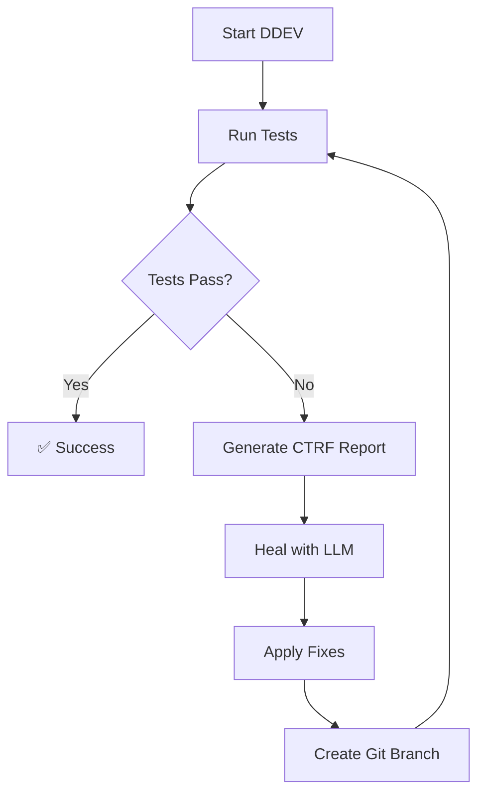

# Local Development Tools for Playwright Testing

Pure local development workflow for Playwright tests with automatic healing using local LLM.

## Overview

This directory contains tools for running and healing Playwright tests against your **local DDEV environment**, completely independent of CI/CD systems.

### Key Features

- ✅ **No GitHub Actions/CICD** - Pure local execution
- ✅ **No external API calls** - All processing stays local
- ✅ **Local LLM integration** - Uses Ollama/OpenCode for test healing
- ✅ **Developer-friendly workflow** - Simple npm commands
- ✅ **Git integration** - Creates branches for healing changes

## Prerequisites

1. **DDEV** running locally:
   ```bash
   ddev start
   ```
   Site should be accessible at: `https://performant-labs.ddev.site:8493`

2. **Ollama** installed and running:
   ```bash
   # Install Ollama
   brew install ollama  # macOS
   # Or download from https://ollama.com/download
   
   # Start Ollama service
   ollama serve &
   
   # Download a coding model
   ollama pull deepseek-coder-v2:16b
   ```

3. **OpenCode CLI** installed:
   ```bash
   # Install globally
   npm install -g @anomalyco/opencode
   # Or via curl
   curl -fsSL https://opencode.ai/install.sh | sh
   ```

## Quick Start

### 1. Setup Local LLM Configuration
```bash
npm run setup:local-llm
```
This creates `.opencode/config.json` and verifies your setup.

### 2. Run Tests Against Local DDEV
```bash
npm run test:local
```
Runs Playwright tests with local configuration (sequential execution, HTML reports).

### 3. Heal Failed Tests
```bash
npm run heal:local
```
Analyzes failed tests using local LLM and suggests fixes.

### 4. Combined Workflow
```bash
npm run test-and-heal
```
Runs tests, then automatically heals any failures.

## Script Details

### `test-local.js`
- Sets `BASE_URL=https://performant-labs.ddev.site:8493`
- Updates `playwright.atk.config.js` for local mode (temporarily)
- Runs tests with sequential execution for easier debugging
- Generates CTRF report for healing script
- Always restores original configuration

### `heal-local.js`
1. **LLM Check**: Verifies Ollama/OpenCode availability
2. **CTRF Report**: Reads test failure details
3. **Analysis**: Uses OpenCode CLI with local model to analyze failures
4. **User Confirmation**: Shows diff and asks before applying changes
5. **Git Integration**: Creates healing branch and commits fixes
6. **Summary**: Reports results and next steps

### `setup-local-llm.js`
- Checks Ollama installation and running status
- Lists available models
- Creates OpenCode configuration for local development
- Tests OpenCode CLI connectivity

## Usage Examples

### Run Specific Test Suites
```bash
npm run test:local -- tests/atk_search
npm run test:local -- tests/atk_components
```

### Run with Playwright Options
```bash
npm run test:local -- --headed --timeout=60000
npm run test:local -- --grep "@smoke"
```

### Heal with Different Model
Edit `.opencode/config.json`:
```json
{
  "model": {
    "provider": "ollama",
    "model": "qwen2.5-coder:7b",
    "options": {
      "temperature": 0.1,
      "maxTokens": 4000
    }
  }
}
```

## Workflow



## Troubleshooting

### Ollama Not Running
```bash
# Check if Ollama is running
curl http://localhost:11434/api/tags

# Start Ollama
ollama serve &

# Verify models
ollama list
```

### OpenCode CLI Not Found
```bash
# Check installation
which opencode

# Install OpenCode
npm install -g @anomalyco/opencode
```

### DDEV Not Accessible
```bash
# Check DDEV status
ddev status

# Start DDEV
ddev start

# Test site access
curl -k https://performant-labs.ddev.site:8493
```

### No CTRF Report Generated
- Ensure `playwright.atk.config.js` has CTRF reporter configured
- Run tests with `npm run test:local` (not plain `npx playwright test`)
- Check `ctrf/` directory exists

## Configuration

### OpenCode Configuration (`~/.opencode/config.json`)
```json
{
  "version": "1",
  "model": {
    "provider": "ollama",
    "model": "deepseek-coder-v2:16b",
    "options": {
      "temperature": 0.1,
      "maxTokens": 4000
    }
  }
}
```

### Environment Variables
- `BASE_URL`: Local DDEV URL (auto-set by `test-local.js`)
- `CI=false`: Disables CI-specific behaviors
- `ATK_REPORT_TARGET`: Cleared for local development

## How It Works

### Test Runner (`test-local.js`)
1. Backs up `playwright.atk.config.js`
2. Updates config for local mode (`operatingMode: 'native'`)
3. Sets environment variables for local DDEV
4. Runs Playwright with local-friendly settings
5. Generates CTRF report in `ctrf/` directory
6. Restores original configuration

### Healing Process (`heal-local.js`)
1. Reads CTRF report to identify failed tests
2. For each failed test:
   - Extracts test file and error details
   - Creates analysis prompt with test context
   - Calls OpenCode CLI with local LLM
   - Parses response for fixed code
   - Shows diff and asks for confirmation
   - Applies fixes if confirmed
3. Creates git branch with healing changes
4. Commits fixed tests

## Best Practices

### 1. Review Changes Before Committing
```bash
# After healing, review changes
git diff healing-branch-name

# Test the fixes
npm run test:local
```

### 2. Use Appropriate LLM Models
- **Code generation**: `deepseek-coder-v2:16b`, `codellama:latest`
- **Reasoning**: `deepseek-r1:32b`, `qwen2.5:14b`
- **Fast iteration**: `qwen2.5-coder:7b`, `llama3.1:8b`

### 3. Monitor Test Performance
- Local tests run sequentially (`--workers=1`)
- Increased timeout (`--timeout=120000`)
- HTML reports in `playwright-report/`

### 4. Regular Maintenance
- Update Ollama models: `ollama pull deepseek-coder-v2:16b`
- Keep OpenCode CLI updated
- Verify DDEV environment compatibility

## Integration with Existing CI

These tools are **completely separate** from CI workflows:

- **CI/CD**: Uses `.github/workflows/` with external Copilot
- **Local**: Uses `local/` directory with local LLM
- **No conflict**: Different configuration, different execution paths

## Extending

### Add New Local Scripts
Place additional local development tools in `local/` directory.

### Customize Healing Prompts
Edit `createHealingPrompt()` method in `heal-local.js`.

### Support Additional LLM Providers
Extend `checkLocalLLM()` to support LM Studio, LocalAI, etc.

## Support

- **Ollama issues**: https://github.com/ollama/ollama
- **OpenCode CLI**: https://opencode.ai
- **DDEV**: https://ddev.readthedocs.io
- **Playwright**: https://playwright.dev

---

*Last updated: 2025-01-19*